# tuis.nvim

A collection of interactive terminal user interfaces for Neovim, built on top of [morph.nvim](https://github.com/jrop/morph.nvim). Provides rich, interactive UIs to various CLIs.

## Features

- Interactive process manager with signal sending capabilities
- Docker container management (inspect, logs, exec, start/stop)
- Kubernetes resource viewers (pods, deployments, services, nodes, events)
- Cloud provider integrations (AWS, GCP)
- System monitoring (resources, processes, services)
- LSP server management
- Bitwarden vault integration

## Screenshots

### Docker
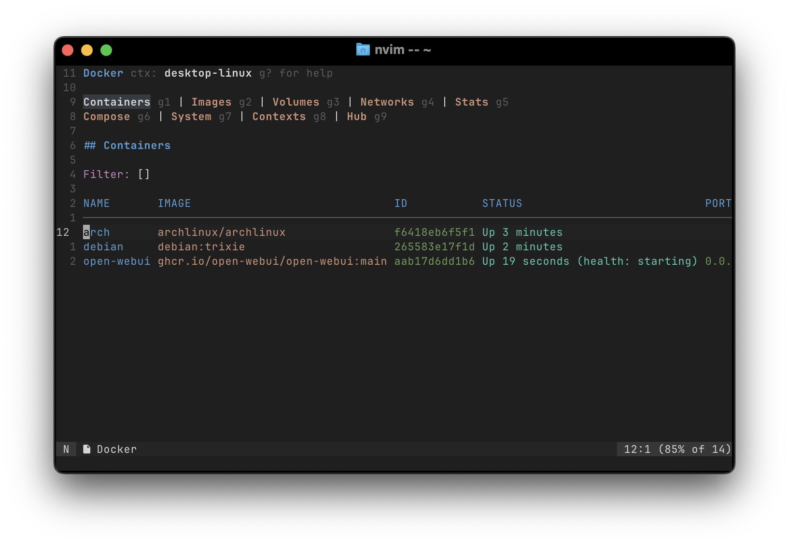

<details>
<summary>More Docker screenshots</summary>

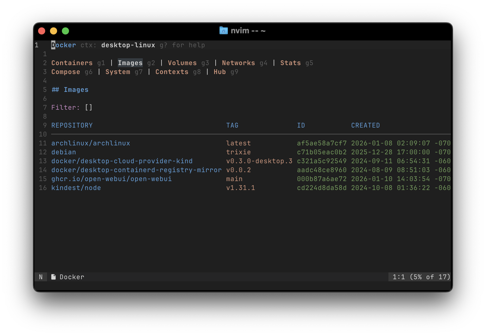
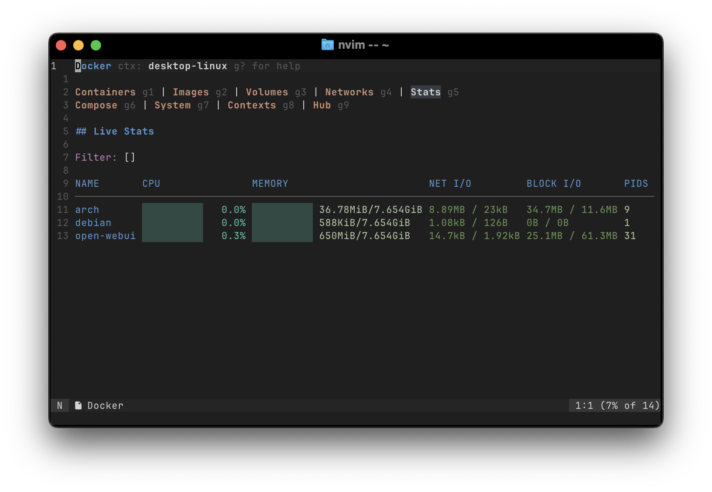
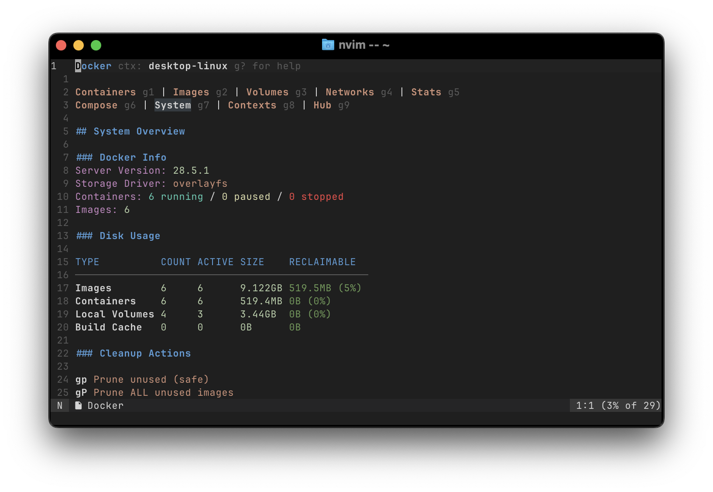

</details>

### Kubernetes
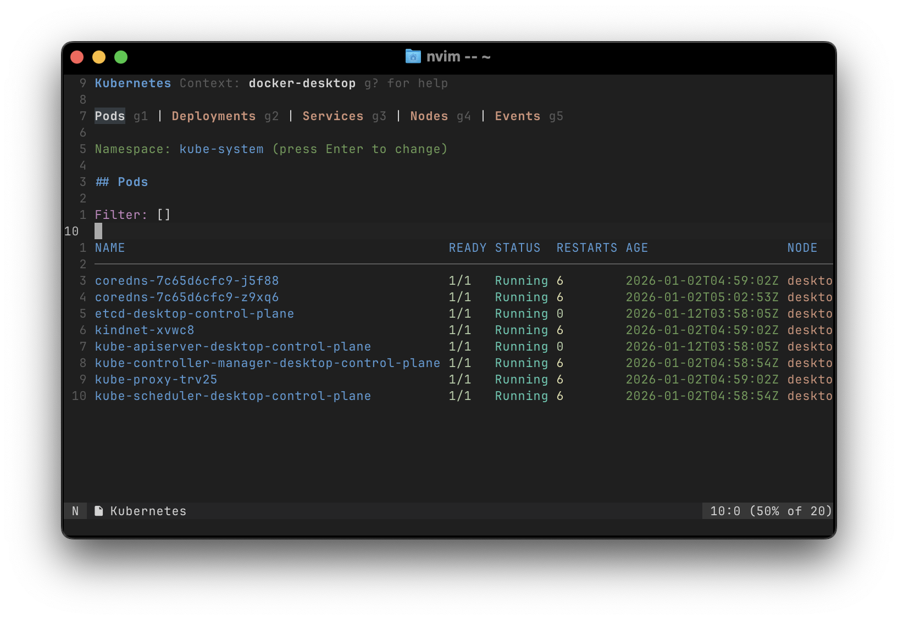

<details>
<summary>More Kubernetes screenshots</summary>

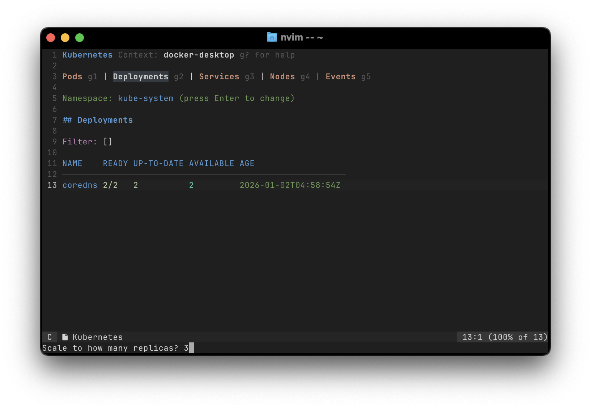
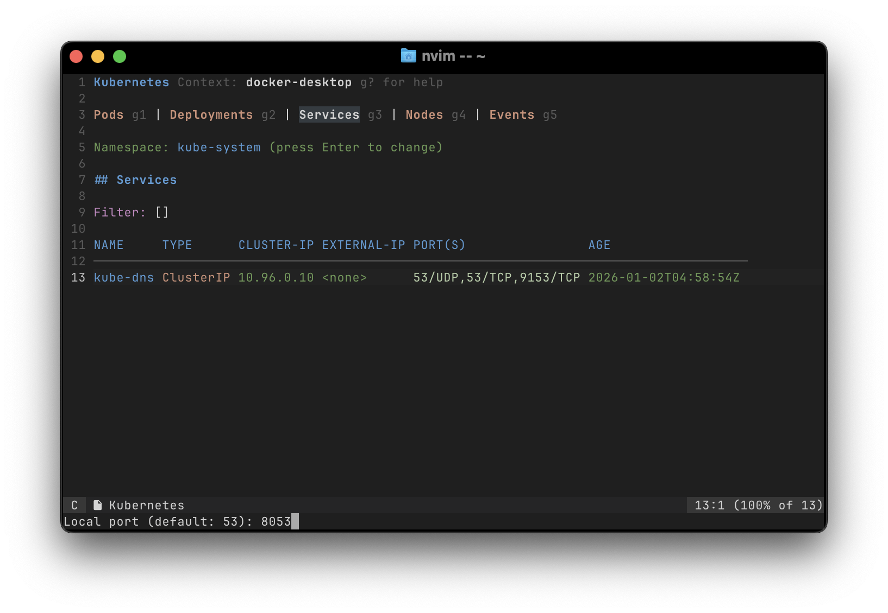


### Process Manager
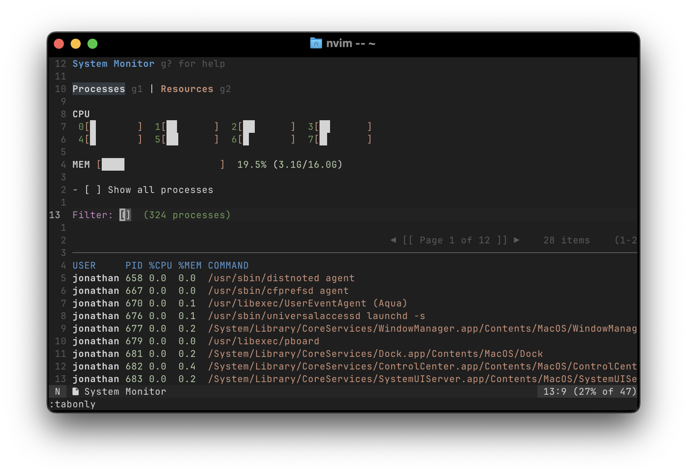

<details>
<summary>More process manager screenshots</summary>

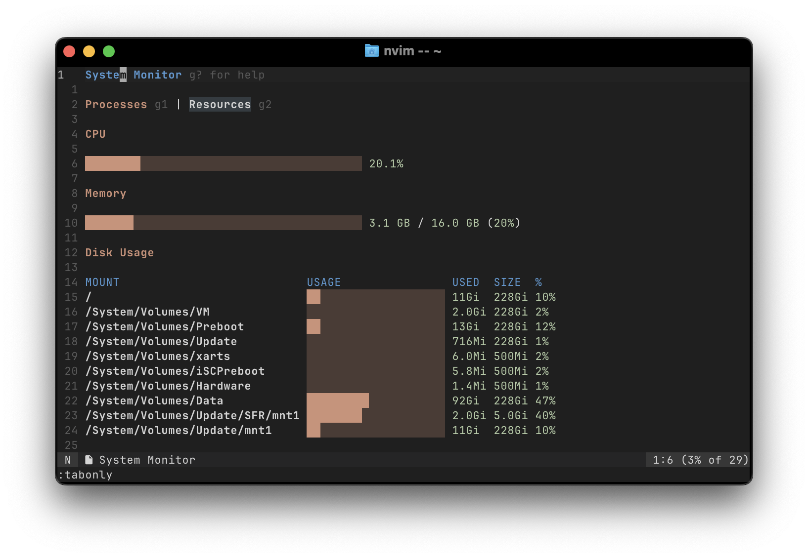

</details>

</details>

### More UIs

<details>
<summary>More UIs</summary>

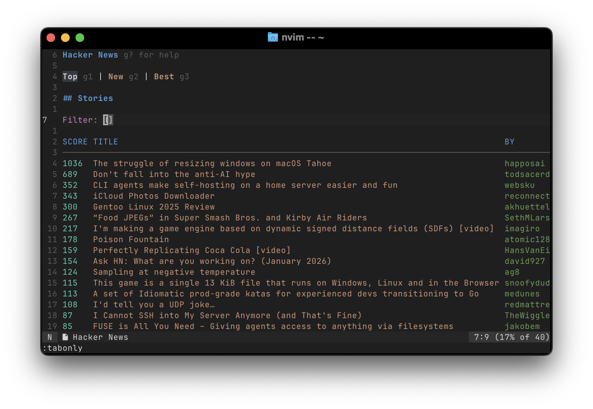
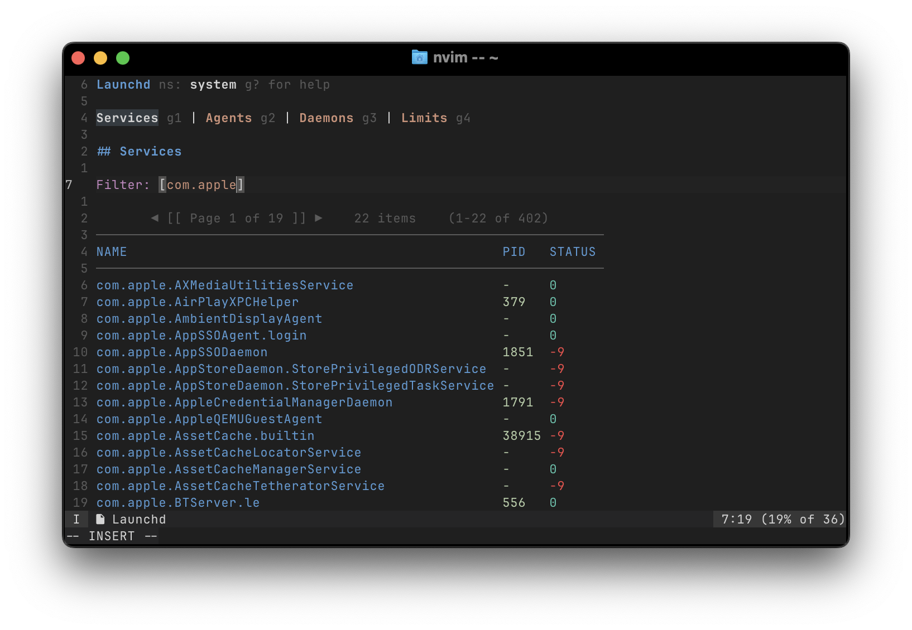
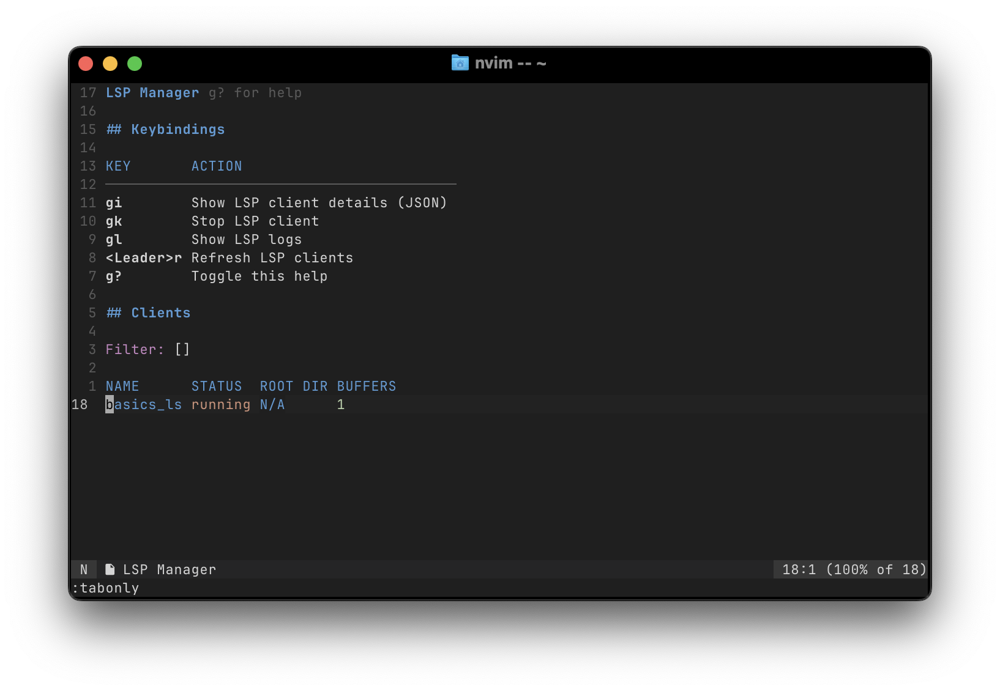
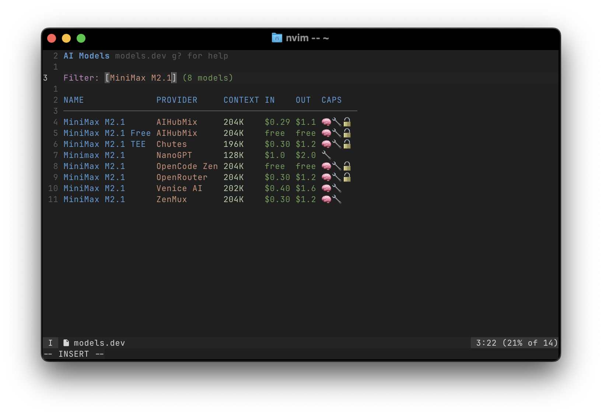

</details>

## Installation

### Using lazy.nvim:

```lua
{
  'jrop/tuis.nvim',
  config = function()
    -- Optional: set up keymaps
    vim.keymap.set('n', '<leader>m', function()
      require('tuis').choose()
    end, { desc = 'Choose Morph UI' })
  end
}
```

### Using vim.pack:

```lua
vim.pack.add('https://github.com/jrop/tuis.nvim')
-- Then add to your `init.lua`:
-- Optional: set up keymaps
vim.keymap.set('n', '<leader>m', function()
  require('tuis').choose()
end, { desc: 'Choose Morph UI' })
```

## Usage

### Listing Available UIs

```lua
local tuis = require('tuis')

-- Get list of all available UIs
local uis = tuis.list()

-- Choose from available UIs in a picker
tuis.choose()

-- Run a specific UI by name
tuis.run('processes')
```

### Available UIs

The plugin includes the following interactive UIs (in `lua/tuis/uis/` directory):

**System Management:**
- `processes` - Interactive process viewer with kill/signal capabilities
- `lsof` - View open files and network connections
- `lsp_manager` - LSP server management

**Services:**
- `systemd` - Systemd service management (Linux)
- `launchd` - Launchd service management (macOS)

**Containers & Orchestration:**
- `docker` - Docker container management
- `k8s` - Kubernetes resource viewer (pods, deployments, services, nodes, events)

**Cloud Providers:**
- `aws` - AWS EC2 instances, Lambda functions, Auto Scaling groups viewer
- `gcloud` - GCP compute instances, instance groups, secrets viewer

**Security:**
- `bitwarden` - Bitwarden vault item viewer

**Developer Tools:**
- `github` - GitHub issues, PRs, and workflow runs
- `hacker_news` - Hacker News reader
- `models-dev` - AI models browser (models.dev)
- `plugin_store` - Neovim plugin browser and installer (__NOTE__: experimental)

## Keybindings

All UIs follow consistent keybinding conventions. Press `g?` in any UI to see context-specific help.

### Universal Keybindings

| Key | Action |
|-----|--------|
| `<Leader>r` | Refresh data |
| `g?` | Toggle help panel |
| `gi` | Inspect/view details (JSON/YAML) |
| `g1`-`g9` | Navigate tabs (multi-page UIs) |

### Common Action Keybindings

| Key | Action | Used In |
|-----|--------|---------|
| `gl` | View logs | Docker, K8s, AWS, Systemd, GitHub |
| `gx` | Execute/shell into resource | Docker, K8s, AWS, GCloud |
| `gk` | Kill/terminate process | Process Manager, lsof, Docker |
| `gs` | Start/scale resource | Docker, Systemd, Launchd |
| `gS` | Stop resource | Docker, Systemd, Launchd |
| `gr` | Restart/rerun | Docker, K8s, Systemd, GitHub |
| `go` | Open in browser/console | AWS, GCloud, GitHub, Bitwarden |
| `gd` | Delete/remove resource | Docker, K8s, Plugin Store |
| `gy` | Yank/copy value to clipboard | lsof, GitHub, Hacker News, Bitwarden |
| `gv` | View related resources | Docker, K8s, AWS |
| `gp` | Push/pull/port-forward | Docker, K8s, GitHub |

### Navigation

| Key | Action |
|-----|--------|
| `<CR>` | Select/open/view details |
| `<C-o>` | Go back (detail views) |
| `[[` / `]]` | Previous/next page |

### Namespace Switching (Systemd/Launchd)

| Key | Action |
|-----|--------|
| `<Leader>s` | Switch to system namespace |
| `<Leader>u` | Switch to user namespace |

# License (MIT)

Copyright (c) 2026 jrapodaca@gmail.com

Permission is hereby granted, free of charge, to any person obtaining a copy of this software and associated documentation files (the "Software"), to deal in the Software without restriction, including without limitation the rights to use, copy, modify, merge, publish, distribute, sublicense, and/or sell copies of the Software, and to permit persons to whom the Software is furnished to do so, subject to the following conditions:

The above copyright notice and this permission notice shall be included in all copies or substantial portions of the Software.

THE SOFTWARE IS PROVIDED "AS IS", WITHOUT WARRANTY OF ANY KIND, EXPRESS OR IMPLIED, INCLUDING BUT NOT LIMITED TO THE WARRANTIES OF MERCHANTABILITY, FITNESS FOR A PARTICULAR PURPOSE AND NONINFRINGEMENT. IN NO EVENT SHALL THE AUTHORS OR COPYRIGHT HOLDERS BE LIABLE FOR ANY CLAIM, DAMAGES OR OTHER LIABILITY, WHETHER IN AN ACTION OF CONTRACT, TORT OR OTHERWISE, ARISING FROM, OUT OF OR IN CONNECTION WITH THE SOFTWARE OR THE USE OR OTHER DEALINGS IN THE SOFTWARE.
